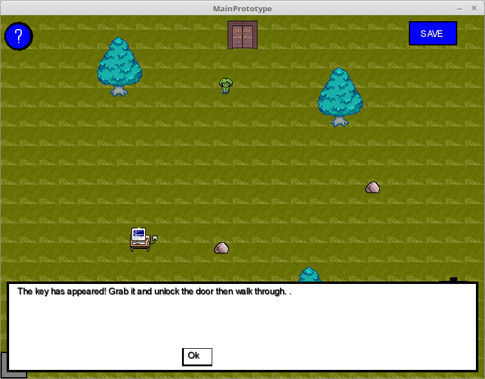

# 2D-Prototype-Java
2D maze game made with Java and LibGDX

To play the game download the .jar executable file download desktop-1.0.jar

When playing the game in an IDE such as eclipse, you will have to run the file "DesktopLauncher.java". If it does not run, you may need to go to run configurations and set the working directory to include the folder "core/assets". In eclipse, you would right click the desktop launcher java file in the package explorer, go to run as, and then run configurations. Go to the arguments tab and in the bottom box titled "Working Directory", click on other and add the assets folder in there. Click apply and the game should run fine.

